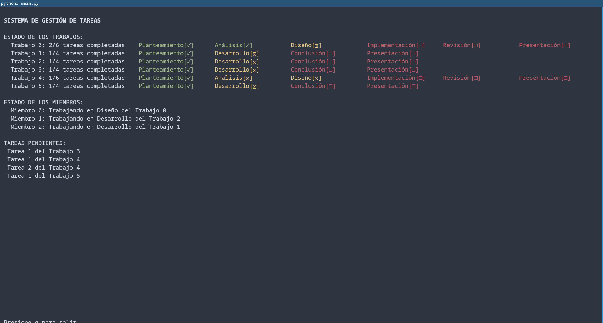

# Proyecto 1

Realizado por Javier Arias Hernández

## Identificación y descripción del probema

Al realizar tareas y proyectos en equipo es necesario poder sincronizarse con los demás integrantes para poder trabajar de una manera correcta y eficiente. Hay algunas tareas que no se pueden empezar a realizar hasta que otras hayan sido completadas, por lo que es importante administrar los tiempos correctamente y conocer en qué está trabajando cada uno de los miembros del equipo.

Si los miembros del equipo no se comunican correctamente no es posible realizar el trabajo de una manera adecuada ya que se va a desperdiciar el tiempo, al haber varios miembros que  podrían estar realizando la misma tarea o no estar enterados que ya pueden empezar a realizar la tarea que tienen asignada si las tareas previas ya fueron finalizadas.

Es por eso que sería útil poder sincronizar al equipo para realizar múltiples trabajos a la vez y que se pueda realizar en el menor tiempo posible. Hay varias tareas que se pueden realizar en paralelo para así ahorrar tiempo y poder continuar con las demás.

## Implementación

Para poder resolver el problema se usaron semáforos en python. Hay 2 tipos de hilos:

- Planificador: Solo hay uno de estos hilos. Es el hilo lider que se encarga de organizar a los demás. Indica cuando hay nuevas tareas listas para ser realizadas a los miembros y comprueba las nuevas tareas.

- Miembros del equipo: Son los hilos encargados de realizar las tareas de cada uno de los trabajos. Toman una tarea la realizan y le notifican al planificador.

Principalmente se utilizó el patrón de hilos jefe/trabajador. Para poder sincronizar los hilos se utilizaron distintos patrones basados en semáforos, estos fueron la señalización y el mutex.

Hay varios miembros del equipo, cada uno representado por un hilo, y varios trabajos. Los trabajos están compuestos por varias tareas, estás tienen que ser realizadas en orden por los miembros del equipo de trabajo. Cada miembro solo puede realizar una tarea a la vez y una tarea solo puede ser realizada por un miembro. Cada una de las tareas necesita que previamente se hayan relizado ciertas tareas previas para poder empezar a realizarse. Hay dos tipos de trabajos, estos se pueden representar de la siguiente manera:

- Tipo 1:
```
           [0] Planteamiento
             /           \
      [1] Análisis   [2] Diseño
             \           /
           [3] Implementación
             /           \
   [4] Revisión    [5] Presentación
```

- Tipo 2:
```
           [0] Planteamiento
                   |
            [1] Desarrollo
             /           \
   [2] Conclusión   [3] Presentación
```
Al principio se crean los trabajos y los miembros indicados por el usuario. Cada uno de los trabajos contienen tareas que inicialmente se marcan como 'no empezadas'. Las que están listas para ser realizadas se marcan como 'pendientes' y se les notifica a los miembros que hay tareas pendientes nuevas. Uno de los miembros empieza a realizar la tarea pendiente, cuando la finaliza marca la tarea como 'completada' la agrega a la lista de tareas completadas y le notifica al planificador que hay una nueva tarea completada.

Cuando el planificador recibe nuevas tareas completadas las procesa y revisa los trabajos de los cuales se finalizaron las tareas, de esta manera puede ver si hay tareas que puedan pasar al estado 'pendiente' y notificarle a los miembros.

Para lograr la comunicación entre los miembros y el planificador se utilizaron semáforos, en esta caso utilizando el patrón de señalización. El estado compartido entre los hilos es la lista de todos los trabajos que se están realizando, las tareas pendientes, tareas completadas y el estado de cada uno de los miembros, al acceder a cada uno de ellos se utiliza un mutex para no causar irregularidades en los datos al momento de leer o escribir.

## Entorno

Se utilizó el lenguaje de programación python, versión 3.13, utilizando las bibliotecas estándar entre ellas la biblioteca curses para la elaboración de la interfaz basada en texto. Solo es necesario tener instalado python3 instalado para la ejecución del programa por medio del siguiente comando:

```
python3 main.py
```

Sólo es necesario indicar el número de miembros del equipo (hilos) y el número de trabajos por realizar.

## Ejecución


