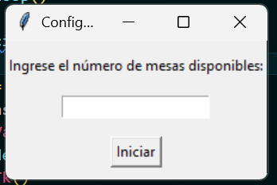
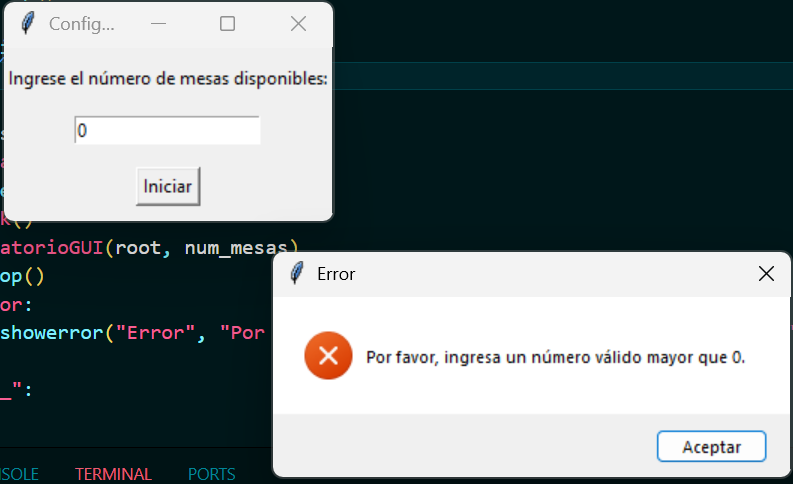
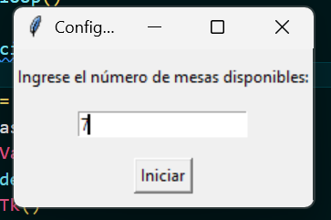
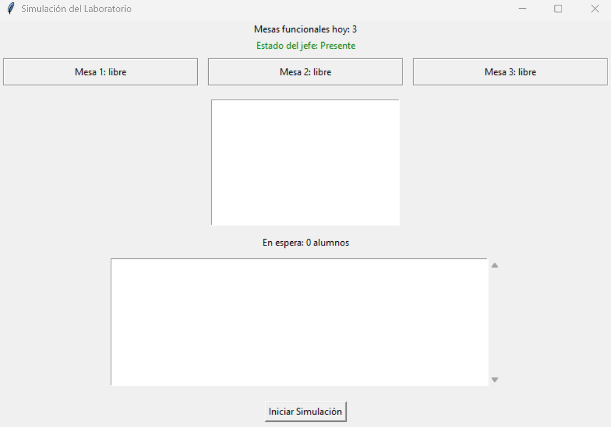
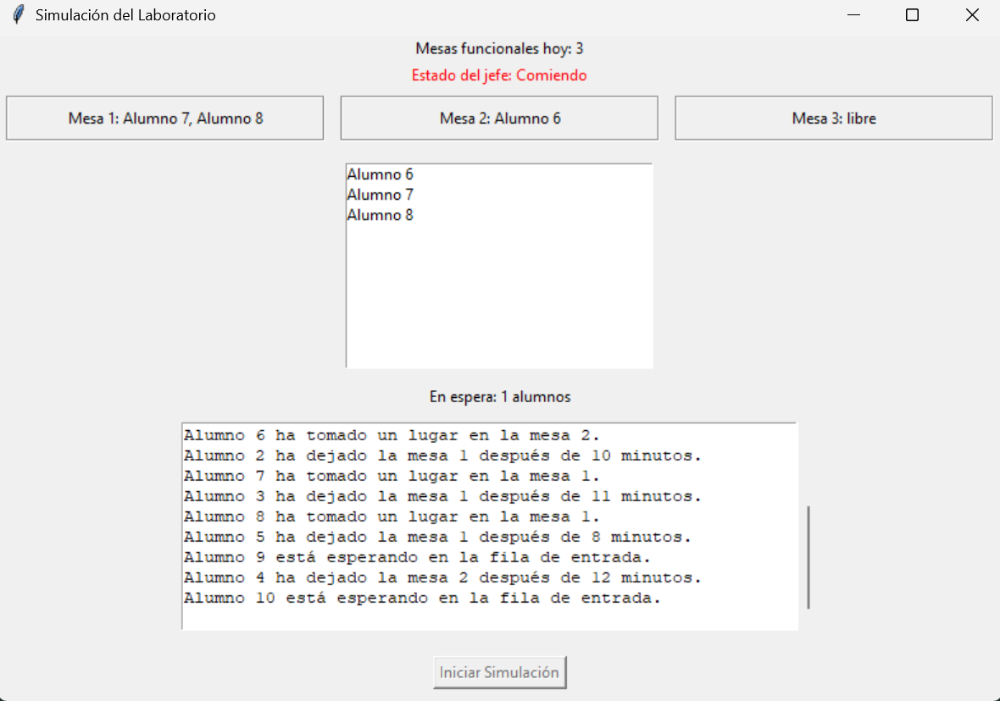
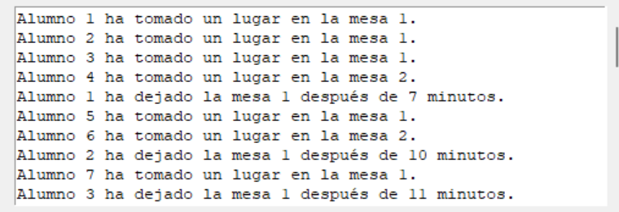
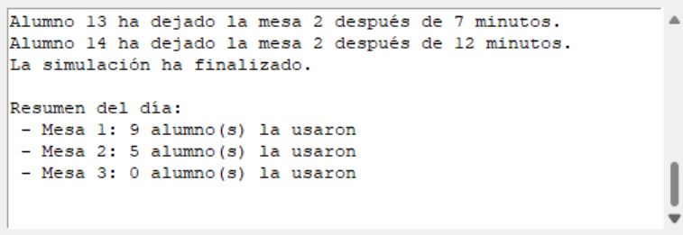
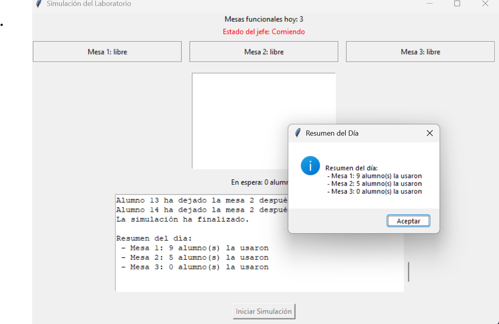

`Integrantes:`  
 1. Ayala Hernandez Maria Fernanda
 2. Portilla Hermenegildo Elizabeth

# 🔍 PROBLEMA: ENTRADA PARA LABORATORIO (Laboratorio de Ingeniería)

Este programa simula el acceso y uso de un laboratorio por parte de alumnos de la Facultad, limitado por un número de mesas funcionales y controlado por un jefe de laboratorio. Se utiliza concurrencia mediante threading para simular las acciones simultáneas de los alumnos y del jefe. También se implementa una interfaz gráfica con tkinter para visualizar en tiempo real el estado del laboratorio.

__Particularidades:__
- El laboratorio tiene un número limitado de mesas (N) definidas por el usuario.
- Puede que cierta cantidad de mesas no este disponibles un dia debido a fallas en su equipo. 
- Si todas las mesas están ocupadas, hasta 6 alumnos pueden esperar en la sala de espera.
- Un jefe de laboratorio administra la entrada y asigna mesas.
- Si el jefe se va a comer, nadie puede entrar al laboratorio, aunque haya mesas libres. Sin embargo, los alumnos que ya están pueden salir.
- Cuando el jefe se va, hasta 6 alumnos pueden esperar en la sala de espera.
- Cuando el jefe regresa, autoriza el ingreso de los alumnos que estaban esperando.
- Finaliza cuando no se tienen más alumnos en el laboratorio o esperando fuera de este.
- Al finalizar se necesita un reporte del total de alumnos que estubo en cada mesa.

Nota: Aun siendo funcionales, las mesas pueden no ser asignadas si no son necesarias.

__Eventos concurrentes__:
- Llegada de alumnos (ocurre periódicamente y en paralelo a otros eventos).
- Asignación de mesas (múltiples alumnos buscan sentarse al mismo tiempo).
- Salida de alumnos (aunque la salida de cada alumno es aleatoria, pueden llegar a concurrir).
- Disponibilidad del jefe (su salida del laboratorio puede ocurrir de manera simultánea a otros eventos).

__Problemas a controlar__:

- Evitar que más de 3 alumnos se sienten en una mesa, para prevenir sobreasignación.
- Asignas mesas funcionales del dia, eligiendo las que no deben ser ocupadas al azar.
- Evitar que más de 6 alumnos esperen en la sala de espera, para controlar la capacidad.
- Bloquear la entrada cuando el jefe no está.
- Permitir que los alumnos puedan salir aunque el jefe no este, para evitar bloqueos innecesarios. 

__Eventos sin orden relativo importante__:

- Salida de alumnos:  Estos pueden salir del laboratorio en un orden cualquiera, pues pasan un tiempo (en minutos) aleatorio en la mesa.

- Llegada de alumnos (si hay disponibilidad):  Su llegada ocurre de manera aleatorio.

- Regreso del jefe: Puede ocurrir en cualquier momento dentro de su intervalo aleatorio designado.

## 🔐 Mecanismos de Sincronización Empleados
`threading.Lock:` Protege las secciones críticas donde varias hebras acceden o modifican recursos compartidos como las mesas, los alumnos activos y la cola de espera.  
`threading.Event:` Controla el estado del jefe (presente o ausente). Los alumnos solo pueden entrar cuando el evento está activo.  
`queue.Queue:` Simula la fila de espera para los alumnos que llegan mientras el jefe está ausente. Es una estructura segura para múltiples hilos.

## ⚙️ Lógica de Operación

1. El usuario ingresa el número de mesas disponibles.
2. Se simula un número aleatorio de mesas funcionales.
3. Los alumnos intentan entrar al laboratorio uno por uno con una pausa aleatoria entre cada llegada.
4. Si el jefe está presente, los alumnos se asignan a una mesa disponible, teniendo como prioridad la primera mesa (mesa 1).
5. Si el jefe está comiendo, los alumnos esperan si hay espacio en la fila (maximo 6 alumnos en espera), si se sobrepasa este numero los alumnos se van del laboratorio.
6. El jefe se va a comer y regresa en intervalos aleatorios.
7. Al final, se muestra un resumen del uso de las mesas.

### 📌 Estado Compartido (Variables Globales / Estructuras Compartidas)
- `self.mesas`: Diccionario que representa las mesas y los alumnos que las ocupan.

- `self.historial_mesas`: Diccionario para contabilizar el uso de cada mesa.

- `self.alumnos_espera`: Cola de espera compartida (_queue.Queue_).

- `self.alumnos_activos`: Lista de alumnos dentro del laboratorio.

- `self.jefe_presente`: Evento que representa la presencia del jefe.

- `self.lock`: Bloqueo que asegura acceso seguro a mesas, _alumnos_activos_ e _historial_mesas_

### 🧮 Descripción Algorítmica de los Hilos
__👩‍🎓 Hilo de cada Alumno:__
- Revisa si el jefe está presente.

_Si el jefe está:_
- Intenta ocupar una mesa (si hay lugar).
- Si logra sentarse, permanece entre 6-12 segundos.
- Libera la mesa al terminar.

_Si el jefe no está:_
- Si hay lugar en la fila, espera.
- Si no hay lugar, se va.

__👨‍🔧 Hilo del Jefe:__
- Espera un intervalo aleatorio (10-20 segundos).
- Se va a comer (5-10 segundos).
- Al volver, permite entrar a los alumnos en espera por orden (mientras haya mesas disponibles).
- Repite el ciclo hasta que no haya alumnos en el laboratorio.

__🧹 Hilo Finalizador:__
- Monitorea la actividad.
- Cuando no quedan alumnos activos ni en espera, finaliza la simulación.

### 🔄 Interacción Entre Hilos
- __Alumnos ↔ Jefe__: Los alumnos dependen del estado del evento _jefe_presente_ para entrar. Cuando está ausente, deben esperar o irse.

- __Alumnos ↔ Recursos compartidos__: Usan lock para acceder y modificar las mesas sin generar condiciones de carrera.

- __Jefe ↔ Fila de espera__: El jefe, al regresar, asigna mesas a los alumnos en espera utilizando el mismo mecanismo que los alumnos al llegar directamente.

## ⚙️ Descripción del entorno de desarrollo
### 🖥️ Entorno de Desarrollo
__Lenguaje__: Python

__Versión__: Python 3.10.12

__Bibliotecas utilizadas__:
- `tkinter` (interfaz gráfica)

- `threading` (manejo de hilos)

- `queue` (estructura de espera)

- `random` (para generar tiempos y situaciones aleatorias)

- `time` (pausas para simular tiempos reales)

⚠️ Todas estas bibliotecas son estándar y no requieren instalación adicional.

###  💻 Sistema Operativo Usado
Sistema operativo: Windows 10

## 💻 Pruebas de ejecucion 

1. Para iniciar, se ejecuta el programa desde la terminal. Al hacerlo, se mostrará una ventana de inicio donde se debe ingresar el número de mesas que tendrá el laboratorio.  

Existen dos posibilidades: 
- Ingresar numero no valido (0 mesas)

- Ingresar numero valido

2. Posteriormente, si se ingresa un número válido, se debe hacer clic en el botón 'Iniciar'. A continuación, se mostrará la ventana de simulación, donde en la parte superior se indica el número aleatorio de mesas funcionales (sin fallas) y el estado actual del jefe (presente o ausente en el laboratorio).

3. Luego, al hacer clic en el botón 'Iniciar Simulación', se mostrará el estado actual de cada mesa, indicando qué alumnos la están ocupando. Además, se registrará la llegada de los alumnos, cuándo se retiran y el tiempo que permanecieron en una mesa. También se actualizará en tiempo real el estado del jefe, indicando si se encuentra en el laboratorio o si ha salido a comer.

4. En el recuadro inferior se muestra un registro detallado de todos los eventos de la simulación: la llegada de los alumnos, la mesa que ocuparon, el tiempo que permanecieron, los alumnos que deben esperar mientras el jefe no está presente, aquellos que se retiran por exceder el límite de espera, el cierre de la simulación cuando ya no quedan alumnos, y finalmente, un reporte indicando cuántos alumnos utilizaron cada mesa durante el día. 

5. Al finalizar la simulación, se muestra una ventana con el reporte del día.  
Finalmente, cierra todas las ventanas del programa.

### 📝 Conclusiones

- El proyecto permitió aplicar conceptos de concurrencia a una situación real de nuestra vida universitaria.

- Usar mecanismos como Lock, Event y Queue ayudó a resolver conflictos por acceso simultáneo a recursos limitados (mesas, sala de espera).

- La ausencia del jefe y el manejo de alumnos en espera requirieron una coordinación precisa entre Hilos.

- La interfaz gráfica facilitó la comprensión del sistema y mejoró la experiencia de usuario.

- Aprendimos a estructurar sistemas concurrentes de forma segura, clara y visualmente atractiva.