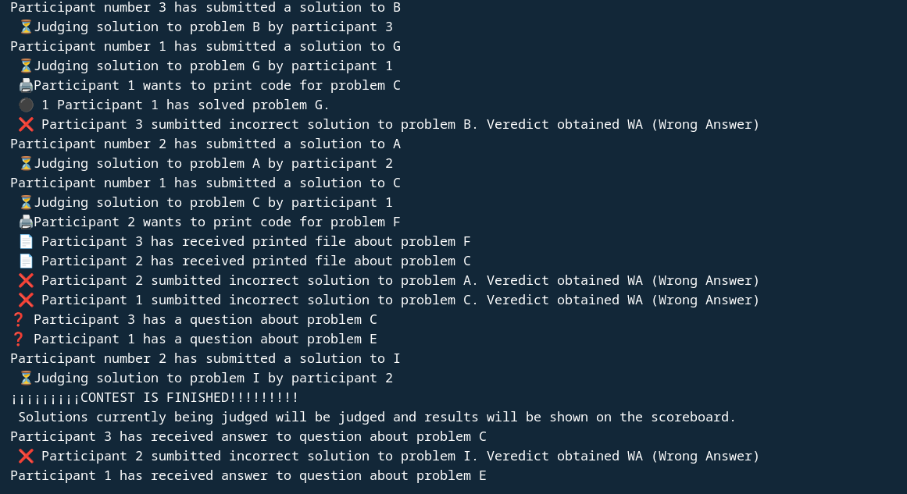
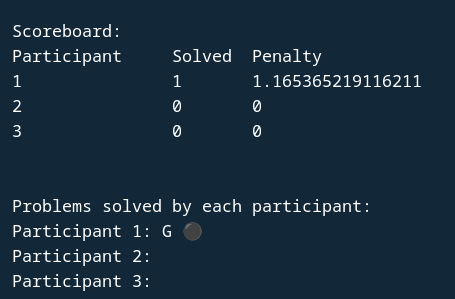

# Proyecto 1: Una situación cotidiana con concurrencia y sincronización.

## Planteamiento del problema
### Concurso de Programación Competitiva (ICPC)

El ICPC es un concurso de programación competitiva que se lleva a cabo anualmente en todo el mundo. En este concurso, los participantes se reunen en equipos de 3 y deben resolver una serie de problemas de programación en un tiempo limitado. Cada problema tiene un puntaje asociado y los participantes deben enviar sus soluciones a través de un sistema de envío.
El sistema de envío es un componente crítico del concurso, ya que permite a los participantes enviar sus soluciones y recibir retroalimentación sobre su desempeño. Todos los participantes deben enviar sus soluciones a través del mismo sistema, lo que puede generar una gran cantidad de tráfico y competencia por los recursos del sistema. Los validadores son los que verifican que la solucion enviada sea correcta. Los validadores revisan las soluciones enviadas en el orden en las que estas van llegando (como una cola).

Ademas del sistema de envío y retroalimentación, el ICPC también cuenta con la opción de que los participantes puedan imprimir documentos durante el concurso. Esto puede incluir la impresión de soluciones, notas o cualquier otro documento que los participantes necesiten durante el concurso, esto es importante ya que los participantes pueden necesitar imprimir documentos pues solo hay una computadora por equipo.

El tercer componente del ICPC es el sistema aclaraciones. Este sistema permite a los participantes enviar preguntas sobre los problemas y recibir respuestas de los jueces. Esto es importante porque los participantes pueden tener dudas sobre el enunciado de los problemas, dichas dudas pueden deberse a alguna oracion que pueda interpretarse de alguna manera o a algun problema en la traducción, ya que aunque la mayoria de las etapas de esta competencia se llevan a cabo en ingles, en la etapa local tambien se dan los problemas en español.

En este proyecto modelaremos el sistema de envío, impresión de documentos y aclaraciones del ICPC. Para ello, utilizaremos mecanismos de sincronización que permitan:
- Controlar el acceso al sistema de envío y retroalimentación y evitar que se intente evaluar una cantidad de soluciones mayor al numero de validadores disponibles.
- Controlar el acceso a la impresora y permitir que las personas que reparten las impresiones las repartan hasta que se haya juntado un número mínimo de impresiones (para evitar exceso de cansancio).
- Controlar el acceso al sistema de aclaraciones y permitir que los participantes envien sus preguntas y reciban respuestas de los jueces, con los jueces respondiendo una pregunta a la vez.


Se debe tener cuidado con algunos aspectos de la concurrencia. No podemos permitir que un validador intente juzgar una solucion si no hay soluciones por juzgar (de una manera similar al problema de productores y consumidor) o que intenten evaluar mas soluciones del numero de validadores disponibles. De igual manera debemos tener cuidado con que los jueces contesten una sola pregunta a la vez.

Para este problema, no hay que tomar en cuenta el orden entre los diferentes participantes ya que cada uno resuelve los problemas a su tiempo. 

A pesar de esto, un equipo que ya haya resuelto algun problema (y el validador les haya dicho que es correcto) no querra volver a enviar mas soluciones a este problema (podria resolver otros en vez de seguir enviando solucion a un problema que ya tienen resuelto). Es por esto que hay que asegurarnos que el equipo obtenga el veredicto de su solucion enviada antes de volver a enviar otra solucion (para el mismo u otro problema). De esta manera, si el problema es aceptado, el equipo ya no vuelve a hacer envios de este.

## Entorno de desarrollo
Empleamos el lenguaje Python 3, en su versión 3.13.2. Se utilizan unicamente bibliotecas de la biblioteca estandar de Python por lo cual no es necesario instalar nada adicional si se tiene Python en la computadora.

EL programa fue probado y desarrollado en dos sistemas operativos distintos:

Fedora Linux 40, se usó para desarrollo y pruebas.\
Mac OS 15.3.2 (M2), se usó para desarrollo y pruebas.

## Ejecución
- Para ejecutar el programa, se debe correr el archivo `competencia.py` en la terminal.
```bash
python competencia.py
```

## Descripción de la solución

Para resolver el problema, utilizaremos los siguientes mecanismos de sincronización:

### Sistema de envío y retroalimentación 
<<<<<<< HEAD
- Para tener los problemas que se tiene que evaluar se utiliza una cola de soluciones, la cual es protegida por un mutex (tanto al momento de la insercion como de los pops). De igual manera, tendremos un semaforo que nos indicara cuantos elementos hay en la cola en ese momento, de manera similar a como lo hariamos en el problema de productores y consumidores. Cuando se envia una solucion a evaluar se aumenta en semaforo en uno y cuando un validador toma una solucion para evaluarla se disminuye en uno. 
\
\
Como se menciono anteriormente, los equipos dejan de enviar soluciones a un problema en el momento en que este problema es resuelto por ellos por lo que se esperan a conocer el resultado de su envio antes de hacer uno nuevo. Para poder hacer esto cada uno de los participantes tiene un threading.Event() que espera hasta que un validador haya juzgado su solucion antes de continuar. Cuando un validador juzga su solucion, se marca que ya sa obtuvo respuesta (con .set()). Si la solucion fue aceptada, se elimina el problema de la lista de problemas a resolver del participante.

### Sistema de impresión de documentos
- Para permitir que las personas que reparten las impresiones las repartan hasta que se haya juntado un número mínimo de impresiones, utilizamos una barrera.
Cuando un equipo quiere imprimir, se crea un nuevo hilo con la informacion de la impresion y el equipo participante sigue trabajando en lo suyo. Cuando se juntan dos impresiones en la barrera, las impresiones se entregan a los equipos correspondientes.

### Sistema de aclaraciones
- Para permitir que los participantes envien sus preguntas y reciban respuestas de los jueces, utilizamos un mutex para proteger el acceso al sistema de aclaraciones. Esto permite que un juez solo pueda responder una pregunta a la vez.

### Fin del concurso

Cada uno de los participantes tomara decisiones (enviar solucion, hacer pregunta o pedir impresion) hasta que se finalice la competencia. Para modelar el final de la competencia se utiliza 'Threading.timer'. Este se inicia cuando empieza la competencia y cuando ha pasado el tiempo establecido para la duracion de la competicion se le hace un (.set()) al evento 'contest_finished' para senalizarle a los participantes que la compentecia ha terminado y que solamente pueden finalizar lo que estaban haciendo en ese momento. Se debe tener cuidado con que algunos hilos esten esperando alguna cosa al momento de que se acaba el concurso ya que se podria llegar a un bloqueo en donde el concurso ya ha terminado pero alguno de los hilos sigue esperando algo que nunca llegara (podria ser la barrera o los validadores con la cola), por lo que se especifica un timeout para estos dos patrones de sincronizacion (si pasa una cierta cantidad de tiempo, terminan su ejecucion).
(esto probablemente no es la mejor manera de hacerlo).

# Pantallazo




=======
- Para tener los problemas que se tiene que evaluar se utiliza una cola de soluciones, la cual es protegida por un mutex.

### Sistema de impresión de documentos
- Para permitir que las personas que reparten las impresiones las repartan hasta que se haya juntado un número mínimo de impresiones, utilizamos una barrera.

### Sistema de aclaraciones
- Para permitir que los participantes envien sus preguntas y reciban respuestas de los jueces, utilizamos un mutex para proteger el acceso al sistema de aclaraciones. Esto permite que solo un juez pueda responder una pregunta a la vez.

### Descripción del entorno de desarrollo

Empleamos el lenguaje Python 3, en su versión 3.13.2.

EL programa fue probado en dos sistemas operativos distintos.
- Fedora Linux 41, se usó para desarrollo y pruebas.
- Mac OS 15.3.2 (M2), se usó para desarrollo y pruebas.

## Ejecución
- Para ejecutar el programa, se debe correr el archivo `competencia.py` en la terminal.
```bash
python competencia.py
```
>>>>>>> 6b2be264a0954b588f1a9716a187327ffa788f37
