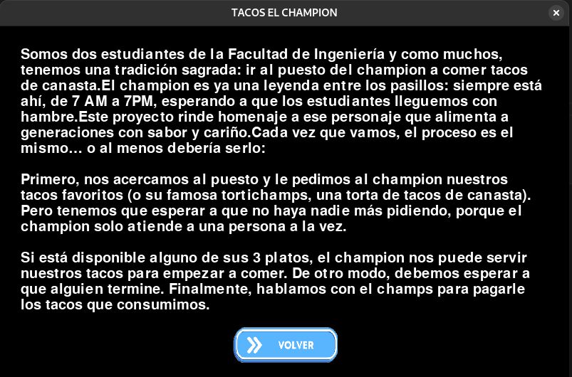
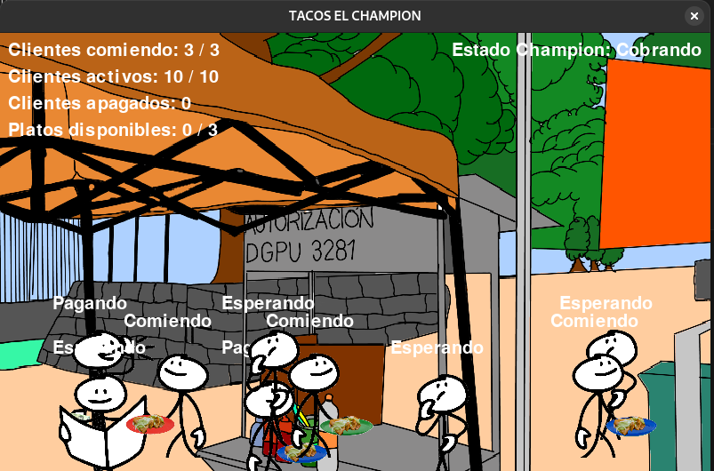
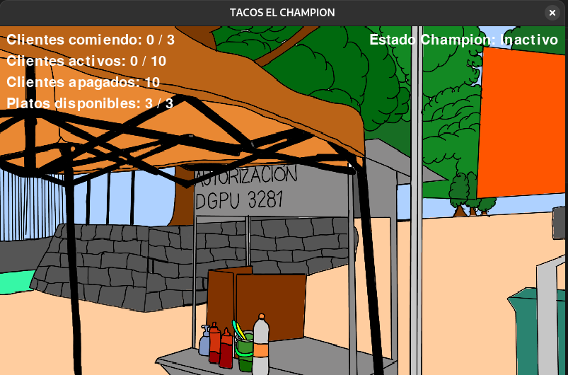

# Proyecto 1: Una situación cotidiana con concurrencia y sincronización.

## Planteamiento del problema

### Tacos el Champion

Somos dos estudiantes de la Facultad de Ingeniería y como muchos, tenemos una tradición sagrada: ir al puesto del champion a comer tacos de canasta. El champion es ya una leyenda entre los pasillos: siempre está ahí, de 7 AM a 7PM, esperando a que los estudiantes lleguemos con hambre.

Cada vez que vamos, el proceso es el mismo… o al menos debería serlo:

Primero, nos acercamos al puesto y le pedimos al champion nuestros tacos favoritos (o su famosa tortichamps, una torta de tacos de canasta). Pero tenemos que esperar a que no haya nadie más pidiendo, porque el champion solo atiende a una persona a la vez.

Si está disponible alguno de sus 3 platos, el champion nos puede servir nuestros tacos para empezar a comer. De otro modo, debemos esperar a que alguien termine.

Finalmente, hablamos con el champs para pagarle los tacos que consumimos.

Todo esto debe hacerse en orden, si alguien trata de pagar antes de pedir o se lanza a comer sin haber hecho la fila, el champion simplemente lo ignora. Reglas son reglas.

## Consecuencias nocivas de la concurrencia y eventos que nos interesa controlar

La principal consecuencia nociva se tiene cuando muchas personas están en el lugar solicitando sus tacos o pagando, se debe de llevar un orden, de otro modo
el Champion y nosotros los clientes nos estresaríamos con tanto caos.

Queremos controlar las siguientes situaciones:

- Que las personas realicen las acciones en orden
- Que el Champion realice una acción a la vez
- Que los platos se asignen de manera correcta y varias personas coman en paralelo.
- Que si alguna persona realiza alguna acción en desorden o no paga de forma correcta, repita todo el proceso

## ¿Hay eventos concurrentes para los cuales el ordenamiento relativo no resulta importante?

Únicamente dos:

- La espera de los clientes para poder ordenar.
- La entrega de los platos al momento de terminar.

Para estas dos, no necesitamos un orden en el que las personas ejecuten estas acciones, pueden hacerlas conforme vayan terminando sin afectar al proceso.

## Descripción de los mecanismos de sincronización empleados

### Semáforo para los platos

Modelamos la clase Platos, como un semáforo con capacidad máxima de K (3 en el caso de nuestro problema) para controlar el acceso de las personas
al recurso, asegurándonos que siempre hay uno para cada persona que ya está en la fase en la que debe comer.

### Exclusión mutua (Mutex) para hablar con el Champion

Con este mecanismo, nos aseguramos que solo una persona pueda hablar con el Champion para cualquier tarea que se requiera, pedir tacos (servirlos en respuesta) y
pagar los tacos (cobrar en respuesta).

## Lógica de operación

### Variables y estructuras globales

- **Hilo del Champion:** Solo una persona puede acceder a él, deben tomar turnos.
- **Semáforo de los Platos:** Máximo 3 personas pueden acceder a ellos al mismo tiempo.

### Descripción del avance de cada hilo o proceso

**Platos**: Los platos siguen un proceso realmente simple. En el primer paso únicamente se revisa si el semáforo permite el acceso (hay platos suficientes).
y se hace *acquire*. En el segundo paso se ejecuta cuando una persona quiere devolver el plato, haciendo *release* al semáforo.

**Champion**: El champion solo tiene tres posibles estados:

- Inactivo: No está atendiendo una petición.
- Sirviendo tacos
- Cobrando: Si el cliente pagó de manera correcta devuelve verdadero, terminando con el proceso del cliente. En caso contrario, devuelve falso, causando que el cliente
repita el proceso.

El disparador de los últimos dos es la petición correspondiente por parte de algún cliente.

**Cliente**: En la lógica marcamos cliente como un hilo daemon, para que al cerrar el programa no haya problema si los procesos de estos hilos no están finalizados.
El cliente tiene 3 intentos para realizar el proceso de consumo de forma correcta, por lo tanto, el hilo se ejecuta mientras su cantidad de intentos sea
menor a 3. El cliente tiene una probabilidad del 10% de hacer trampa en el proceso, por lo tanto se calcula al inicio. En caso de que haga trampa, se envía a esperar su 
reintento.

Posterior a eso, solicita sus tacos y un plato. Revisará el semáforo y en caso de que no haya platos disponibles, esperará. Después de eso, comerá, para finalmente liberar el plato y disponerse a pagar. En este caso, hay una probabilidad de un 15% de que el cliente haga trampa pagando, por lo que si al pagar hizo trampa, será enviado a esperar su reintento. De otro modo, el hilo finaliza su proceso y se apaga.

### Interacción entre hilos

- El cliente solicita tacos al Champion, este se los sirve
- El cliente ocupa el plato para comer sus tacos
- El cliente paga al Champion
- Si al cobrar, el Champion detecta una anomalía, envía el disparador para que haga el proceso de nuevo

## Descripción del entorno de desarrollo

Empleamos el lenguaje Python 3, en su versión 3.13.2.

Usamos una biblioteca para la generación de ventanas y gráficos, basada en la biblioteca SDL de C, la cual es *pygame*. Esta se instala por medio del comando `pip install pygame`.

El programa fue probado en tres sistemas operativos distintos.

- Fedora Linux 41 (Sistema de Gustavo Valenzuela), se usó para desarrollo y pruebas.
- Ubuntu 24.04 (Sistema de Yordi Jiménez), se usó para desarrollo y pruebas.
- Windows 10 2H22 (Sistema secundario de Yordi Jiménez), se usó únicamente para pruebas.

## Ejecución del programa

Para ejecutar el programa se debe de ejecutar el siguiente comando `python3 Menu.py`

Menú principal

Apartado de información

Ejecución del programa

Fin del programa
